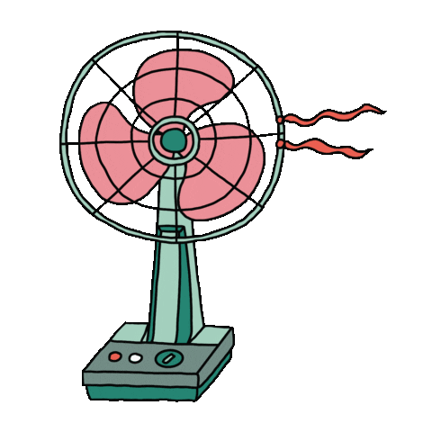

 
# 🌀 capstone_design_2026 🌀

<h3 align="center">🌬️ 선풍기 💨</h3>

 

 

음성의 <b>텍스트</b> · <b>감정</b> 분리를 통한 저트래픽 음성 통신 

 

## 👥 Team Members

<table>
  <tr>
    <td align="center" width="220px">
      <a href="https://github.com/Pachyhead">
        
         
         
        
         
        <strong>👑 이종찬</strong>
      </a>
       
      <a href="https://github.com/Pachyhead">@Pachyhead</a>
    </td>
    <td align="center" width="220px">
      <a href="https://github.com/zxxxv">
        
         
         
        
         
        <strong>🌀 최재웅</strong>
      </a>
       
      <a href="https://github.com/zxxxv">@zxxxv</a>
    </td>
  </tr>
  <tr>
    <td align="center" width="220px">
      <a href="https://github.com/KyeongTaek">
        
         
         
        
         
        <strong>🌀 임경택</strong>
      </a>
       
      <a href="https://github.com/KyeongTaek">@KyeongTaek</a>
    </td>
    <td align="center" width="220px">
      <a href="https://github.com/TaeWonM">
        
         
         
        
         
        <strong>🌀 민태원</strong>
      </a>
       
      <a href="https://github.com/TaeWonM">@TWMin</a>
    </td>
  </tr>
</table>

 

---

### 🛠️ Tech Stack ⚙️

